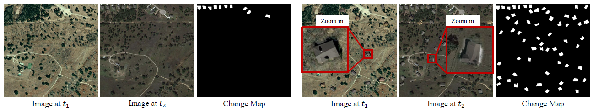
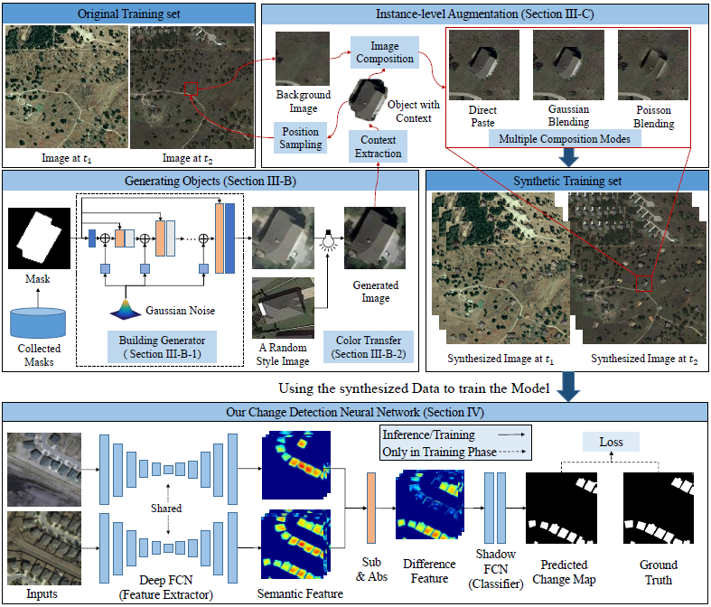

# IAug_CDNet
**Official Pytorch Implementation of Adversarial Instance Augmentation for Building Change Detection in Remote Sensing Images.**

Coming soon~~~~

## Overview

We propose a novel data-level solution, namely Instance-level change Augmentation (IAug), to generate bi-temporal images that contain changes involving plenty and diverse buildings by leveraging generative adversarial training. The key of IAug is to blend synthesized building instances onto appropriate positions of one of the bi-temporal images. To achieve this, a building generator is employed to produce realistic building images that are consistent with the given layouts. Diverse styles are later transferred onto the generated images. We further propose context-aware blending for a realistic composite of the building and the background. We augment the existing CD datasets and also design a simple yet effective CD model - CDNet. Our method (CDNet + IAug) has achieved state-of-the-art results in two building CD datasets (LEVIR-CD and WHU-CD). Interestingly, we achieve comparable results with only 20\% of the training data as the current state-of-the-art methods using 100\% data. Extensive experiments have validated the effectiveness of the proposed IAug. Our augmented dataset has a lower risk of class imbalance than the original one. Conventional learning on the synthesized dataset outperforms several popular cost-sensitive algorithms on the original dataset.

## Requirements

## Setup

