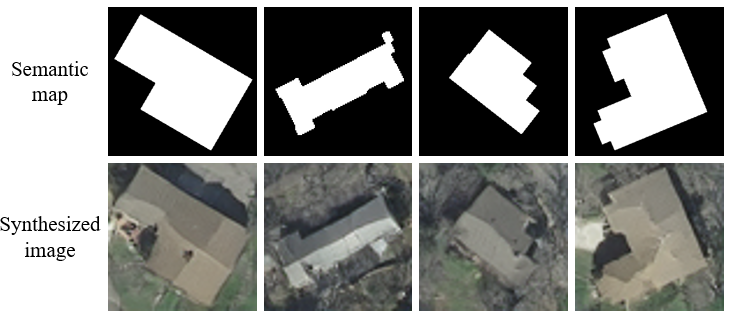

# Building Generator

Our building generator is based on [GauGAN](https://arxiv.org/abs/1903.07291).

Synthesized images (256 * 256) by the generator (trained on the AIRS building dataset).

Synthesized images (64* 64) by the generator (trained on the Inria building dataset).

## Installation

This code requires PyTorch 1.0 and python 3+. Please install dependencies by
```bash
pip install -r requirements.txt
```

## Generating Images Using Pretrained Model

Once the dataset is ready, the result images can be generated using pretrained models.

1. Download the tar of the pretrained models from the Google Drive

    - Inria_pretrained: [net_G](https://drive.google.com/file/d/1YwwX7IwxSGR5551OIKRicemQpAxRJuCL/view?usp=sharing), [net_D](https://drive.google.com/file/d/1DIHLV_e7nd4kjDVnILg5mqjR9gxnJmEZ/view?usp=sharing) 
    - AIRS pretrained: [net_G](https://drive.google.com/file/d/1eGMwYKaaKvNellBrTV51jfeJZuPVIjm3/view?usp=sharing), [net_D](https://drive.google.com/file/d/1q5-GJcYoB7niVdR2YEftdi0NP2L2Fo0w/view?usp=sharing)
    - save it in 'checkpoints/', and run

2. Generate images using the pretrained model.
    ```bash
    python test.py --model pix2pix --name $pretrained_folder --results_dir $results_dir --dataset_mode custom --label_dir $label_dir --label_nc 2 --batchSize $batchSize --load_size $size --crop_size $size --no_instance --which_epoch lastest
    ```
    `pretrained_folder` is the directory name of the checkpoint file downloaded in Step 1, `results_dir` is the directory name to save the synthesized images, `label_dir` is the directory name of the semantic labels, `size` is the size of the label map fed to the generator.  

3. The outputs images are stored at `results_dir`. You can view them using the autogenerated HTML file in the directory.

For simplicity, we also provide the test script in `scripts/run_test.sh`, one can modify the `label_dir` and `name` and then run the script.

## Training New Models

New models can be trained with the following commands.

1. Prepare the dataset. You can first prepare the building image patches and corresponding label maps in two folders (`image_dir`, `label_dir`).

2. Train the model.

```bash
# To train on your own custom dataset
python train.py --name [experiment_name] --dataset_mode custom --label_dir [label_dir] -- image_dir [image_dir] --label_nc 2
```

There are many options you can specify. Please use `python train.py --help`. The specified options are printed to the console. To specify the number of GPUs to utilize, use `--gpu_ids`. If you want to use the second and third GPUs for example, use `--gpu_ids 1,2`.

To log training, use `--tf_log` for Tensorboard. The logs are stored at `[checkpoints_dir]/[name]/logs`.

## Acknowledge

This code borrows heavily from [spade](https://github.com/nvlabs/spade/).


